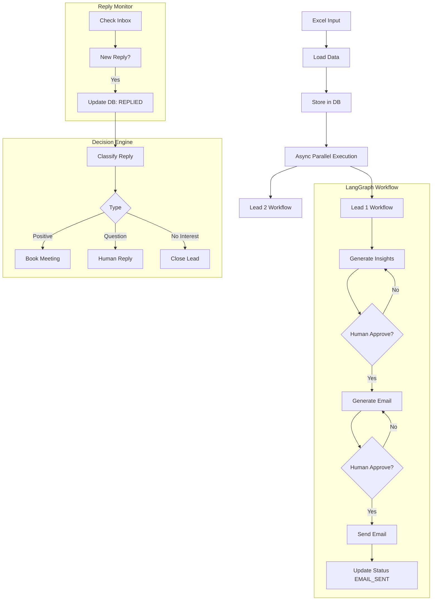

# SYSTEM ARCHITECTURE

The system is event-driven and parallel. It does not run one long blocking workflow.

Components:

1. Parallel Workflow Engine (LangGraph)
2. Database (SQLite)
3. Background Workers (async loops)

---

## HIGH LEVEL FLOW

Excel Input -> Create Leads -> Run Parallel Workflows -> Send Emails -> Wait for Replies -> Process Replies -> Continue Flow

---

## DETAILED FLOW

```
            +----------------------+
            |   Excel Input File   |
            +----------+-----------+
                       |
                       v
            +----------------------+
            |   Load (openpyxl)    |
            +----------+-----------+
                       |
                       v
            +----------------------+
            |  Store in SQLite DB  |
            | status = INIT        |
            +----------+-----------+
                       |
                       v
    +---------------------------------------+
    |  Async Parallel Execution             |
    |  asyncio.gather() + Semaphore(max 5)  |
    +----------+--------+-------------------+
               |        |
               v        v
     +-------------+  +-------------+  ... (parallel)
     |   Lead 1    |  |   Lead 2    |
     +------+------+  +------+------+
            |                 |
            v                 v
    +---------------------------------------+
    |     LangGraph Workflow (per lead)     |
    +---------------------------------------+

    START
      |
      v
    generate_insights (LLM)
      |
      v
    human_validate_insights
      +-- reject -> generate_insights
      +-- approve
      |
      v
    generate_email (LLM)
      |
      v
    human_validate_email
      +-- reject -> generate_email
      +-- approve
      |
      v
    send_email (SMTP)
      |
      v
    update DB status = "EMAIL_SENT"
      |
      v
    end_node -> END
```

---

## DESIGN RULE

The LangGraph workflow ENDS after sending the email. It does NOT wait for replies.

---

## BACKGROUND WORKER 1: Reply Monitor

Runs every N minutes asynchronously.

Flow:

```
Check Inbox (IMAP)
      |
      v
If new reply:
      |
      v
Update DB: status = REPLIED, store reply text
```

---

## BACKGROUND WORKER 2: Decision Engine

Runs periodically. For each lead with status = REPLIED:

```
      |
      v
classify_reply (LLM)
      |
      v
decision_node
```

Branches:

1. POSITIVE: Send meeting confirmation email, generate pre-meeting document (LLM), status = MEETING_BOOKED
2. QUESTION: Ask human for response (CLI), send reply, status = WAITING_REPLY
3. NO_INTEREST: status = CLOSED

---

## DATABASE DESIGN

Table: leads

- id, name, email, company
- insights, email_draft, status
- reply, classification, meeting_booked
- pre_meeting_doc
- created_at, updated_at

---

## CONCURRENCY MODEL

- asyncio for parallel workflows
- Semaphore limits concurrency (default max 5 tasks)
- Async used for: LLM calls, email send, DB operations (aiosqlite)

---

## MERMAID DIAGRAM


